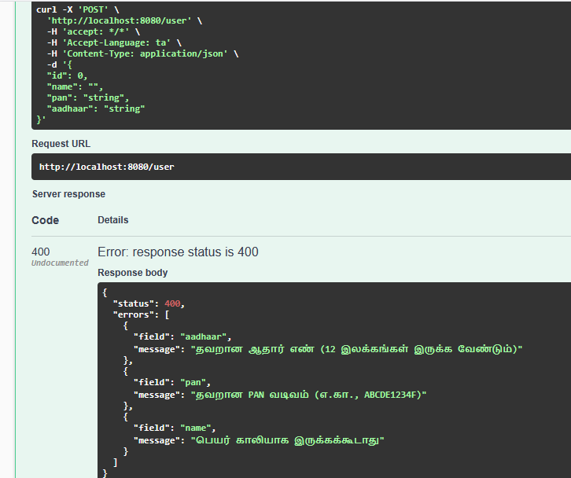
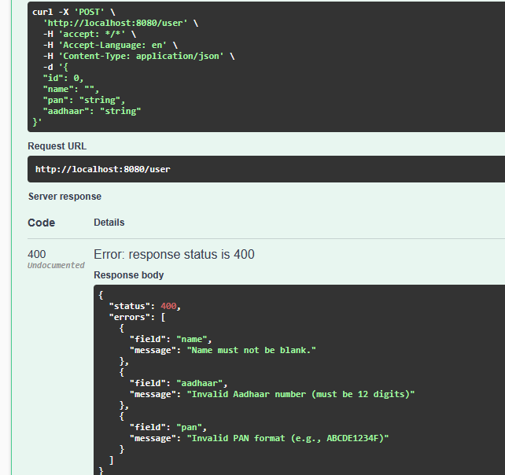

# Binding Custom Validation Messages

Swagger URL : [http://localhost:8080/swagger-ui/index.html](http://localhost:8080/swagger-ui/index.html)

To guide users and guarantee data integrity, validation is crucial. 

Spring Boot uses the Java Bean Validation framework (JSR-380), enabling developers to annotate fields with constraints such as `@NotBlank, @Email, and @Min`.

For improved `localization and maintainability`, we can bind error messages to external properties rather than hard-coding them.

### Localization

1. Create `ValidationMessages_ta.properties` file
2. Create `messageSource` bean `file:src/main/java/com/thirumal/config/ValidationMessageConfig.java`
3. Use the `KEY` in the validation message like `@NotBlank(message = "{user.name.notblank}")`

### Custom Validation annotation 

1. Create annotation
2. Create validator by implementing `ConstraintValidator`

### Example

Localization in Tamil Language

Localization with English Language

